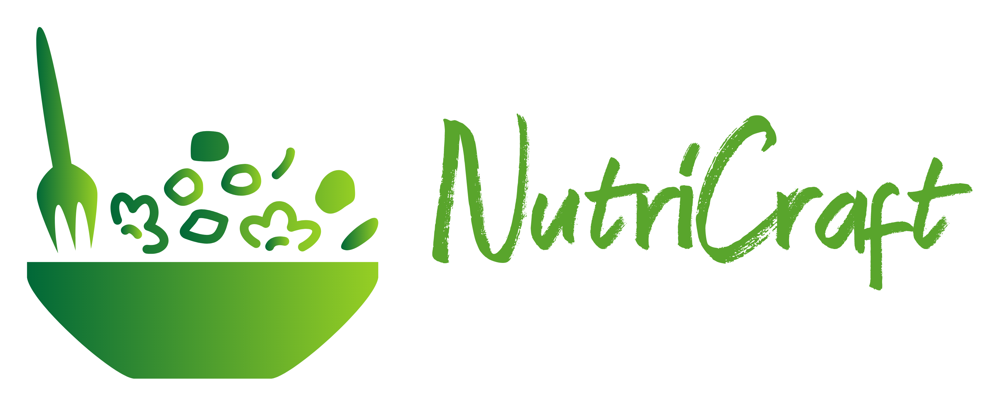

# NutriCraft 🍲✨

NutriCraft is a versatile recipe application that empowers users to explore, discover, and manage their culinary adventures. Elevate your cooking experience with NutriCraft's rich set of features.



<!--  -->

## Features 🪶

- **Search by Name:** Find your favorite recipes effortlessly.
- **Related Recipes:** Explore a variety of related recipes.
- **Ingredients Display:** View all the ingredients for each recipe.
- **Nutrition Values:** Access detailed nutrition information.
- **Bookmarking:** Save and organize your favorite recipes.
- **Shopping List:** Easily add ingredients to your shopping list.
- **Filter by Category:** Find recipes based on categories.
- **Search by Nutrition Value:** Discover recipes based on nutritional preferences.
- **Meal Planning:** Mark meals on the calendar for easy tracking.

## Demo 🚀

Check out the live demo of NutriCraft: [Deployed Link](https://nutricraft.netlify.app/)

## Technologies Used 🛠️

- HTML5
- CSS
- JavaScript
- ES6 Features
- MVC Architecture
- Parcel Bundler

## Contributing 🤝

Contributions are welcome!

1. **Fork the repository.**

   - Click on the "Fork" button at the top right corner of this page.

2. **Clone the forked repository.**
   ```bash
   git clone https://github.com/ayanghanta/NutriCraft.git
   ```
